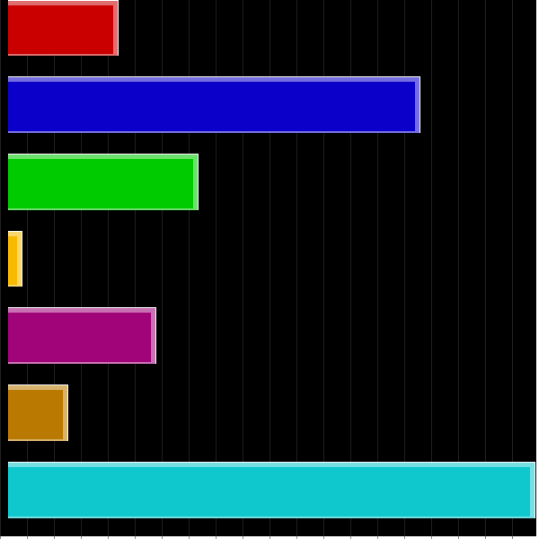

# graph
<!DOCTYPE html>
<html>
 <body>
<h1>Un générateur de graphique de statistique personnalisable</h1>

peut etre utilise sans option, ou personnaliser

  <h3>paramètre obligatoire</h3>
  <ul>
   <li>"col" pour graphique en colonne</li>
   <li>"pie" pour graphique en cammenbert</li>
   <li>"bar" pour graphique en bar horizontale</li>
  </ul>

  pour les données un array avec le libelée et la valeur
  $data = ['libele1' => valeur1 , 'libele2' => 'valeur2' ];
  

  <ul> Option
   <li>with : pour la taille</li>
   <li>setAutodVal : (bool) pour convertir les valeurs en pourcentages</li>
   <li>setLegend : (bool) pour afficher legend sur coter</li>
   <li>setCouleur : (rgb) pour couleur ecriture</li>
   <li>sav : (bool) pour sauvegarder l'image generer dans dossier "graph" ou visualissation en temps reel</li>
   <li>setOrdre: modifier l'ordre d'affichage du tableau pour, null ordre non mofifier , "c" ordre coissant , "d" ordre décroissant</li>
   <li>et d'autre ....</li>
  </ul>
  

 <h4>exemples </h4>
 <h2 dir="auto"> en colonnes "col"</h2>
 
 <pre>
 include 'app/graph.php';
 $graf = new Graph();
 $data1 = ['lundi' => 125, 'mardi' => '348', 'mercredi' => '100', 'jeudi' => 425, 'vendredi' => 100, 'samedi' => '568', 'dimanche' => 405];
 $graf->setAutodVal(false)->Graph('col', $data1, 'semaine 1');</pre>
 

  
      <h2 dir="auto"> en camenbert "pie"</h2>
<pre> 
 include 'app/graph.php';
 $graf = new Graph();
 $data2 = ['lundi' => 205, 'mardi' => '748', 'mercredi' => '400', 'jeudi' => 55, 'vendredi' => 500, 'samedi' => '578', 'dimanche' => 805];
$graf->Graph('pie', $data2, 'semaine 2'); </pre>
 
  
      <h2 dir="auto"> en barre "bar"</h2>
<pre> 
 include 'app/graph.php';
 $graf = new Graph();
 $data3 = ['lundi' => 115, 'mardi' => '398', 'mercredi' => '190', 'jeudi' => 25, 'vendredi' => 150, 'samedi' => '68', 'dimanche' => 505];
$graf->setLegend(0)->setCouleur('255.255.255')->Graph('bar', $data3, 'semaine 3');</pre>
 
	</body>
</html>
